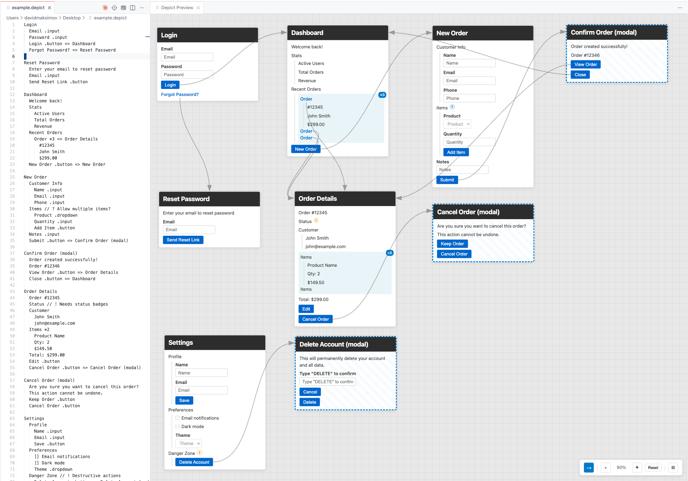

# Depict Preview

[](https://marketplace.visualstudio.com/items?itemName=fastfollow.depict-preview)

A VS Code extension that renders visual wireframe previews from simple text-based screen definitions. Perfect for rapidly documenting and visualizing application screens, user flows, and UI specifications.



## Features

- **Live Preview**: See your screen definitions rendered as interactive wireframe cards in real-time
- **Bidirectional Navigation**: Click a card to jump to its definition in code, or move your cursor in code to highlight the corresponding card
- **Drag & Drop Layout**: Arrange cards freely on the canvas - positions are saved per file
- **Navigation Arrows**: Visualize screen flows with automatic arrows between linked screens
- **Auto-Organize**: Automatically arrange cards into logical groups based on navigation relationships and naming patterns
- **Zoom & Pan**: Navigate large screen maps with mouse wheel zoom and pan controls
- **Modal Support**: Screens marked as modals get distinctive dashed borders

## Syntax Reference

### Screens (Places)

Any line at the root level (no indentation) defines a new screen:

```
Dashboard
Admin - Users - Index
Settings (modal)
```

Screens with "modal" in the name are styled with a dashed border.

### Items

Indented lines become items within a screen. Nesting is supported:

```
User Profile
  Header
    Avatar
    Username
  Settings
    Theme Toggle
    Notifications
```

### Type Annotations

Add `.type` to specify how an item should render:

| Annotation | Renders As |
|------------|-----------|
| `.input` | Text input field |
| `.button` | Button |
| `.checkbox` | Checkbox with label |
| `.radio` | Radio button with label |
| `.dropdown` | Dropdown select |
| `.link` | Styled link |

```
Login Form
  Email .input
  Password .input
  Remember me .checkbox
  Submit .button
```

### Checkbox/Radio Shorthand

You can also use bracket syntax:

```
Options
  [] Subscribe to newsletter
  () Option A
  () Option B
```

### Navigation

Use `=>` to indicate navigation to another screen:

```
User List
  View Details .button => User Details
  Create New .link => Create User Form
```

Navigation creates clickable elements and draws arrows between screens.

### Multiplicity

Use `*N` to indicate repeated items:

```
User Table
  Row *5
    Name
    Email
    Actions
```

This renders the item multiple times (up to 3 shown with "..." indicator).

### Conditional States

Use `@state` to show items that appear under certain conditions:

```
Profile
  @authenticated
    Edit Profile .button
  @guest
    Sign In .link
```

### Comments

Add `//` comments for notes. Use prefixes for different styles:

| Prefix | Style | Use For |
|--------|-------|---------|
| `// text` | Note (purple) | General notes |
| `// ? text` | Question (blue) | Open questions |
| `// ! text` | Warning (orange) | Important warnings |
| `// i text` | Info (green) | Informational notes |

```
Order Form
  Total Price // ? Should this include tax?
  Submit .button // ! Requires validation
```

Comments appear as small icons that show the full text on hover.

## Canvas Controls

| Control | Action |
|---------|--------|
| Scroll | Pan vertically |
| Shift + Scroll | Pan horizontally |
| Cmd/Ctrl + Scroll | Zoom in/out |
| Cmd/Ctrl + `+`/`-` | Zoom in/out |
| Cmd/Ctrl + `0` | Reset zoom |
| Space + Drag | Pan canvas |
| Drag card header | Move card |
| Click card header | Jump to source line |

### Toolbar Buttons

- **Arrow toggle (→)**: Show/hide navigation arrows
- **Zoom controls (-/+)**: Adjust zoom level
- **Reset**: Reset zoom and pan to defaults
- **Auto-organize (⊞)**: Automatically arrange cards into groups

## Auto-Organize Algorithm

The auto-organize feature groups screens intelligently:

1. **Navigation Clusters**: Screens connected by navigation arrows are grouped together
2. **Word Similarity**: Unconnected screens are grouped by shared words in their names (works with any naming convention - "Admin - Users - Index", "UserProfile", "create-user", etc.)
3. **Layout**: Groups are arranged in rows with visual separation between them

## File Types

The extension activates for:
- Files named `screens.txt`
- Files with `.depict` extension

## Usage

1. Create a `.depict` file or `screens.txt`
2. Click the preview icon in the editor title bar, or run "Show Depict Preview" from the command palette
3. Write your screen definitions
4. Arrange cards as needed - positions are saved automatically

## Example

```
Login
  Email .input
  Password .input
  Login .button => Dashboard
  Forgot Password? .link => Reset Password

Reset Password
  Email .input
  Submit .button

Dashboard
  Welcome back!
  Stats
    Users Online
    Total Orders
    Revenue
  Quick Actions
    New Order .button => Create Order
    View Reports .link => Reports

Create Order
  Customer .dropdown
  Items *3
    Product .dropdown
    Quantity .input
    Remove .button
  Add Item .button
  Submit .button => Order Confirmation

Order Confirmation (modal)
  Order #12345 created successfully!
  View Order .button => Order Details
  Close .button
```

## Installation

### From VS Code Marketplace

1. Open VS Code
2. Go to Extensions (Cmd/Ctrl + Shift + X)
3. Search for "Depict Page Preview"
4. Click Install

Or install via command line:
```bash
code --install-extension fastfollow.depict-preview
```

### Development

```bash
git clone https://github.com/fastfollowsoftware/depict-preview.git
cd depict-preview
npm install
npm run compile
```

Then press F5 in VS Code to launch the extension development host.

## License

MIT
